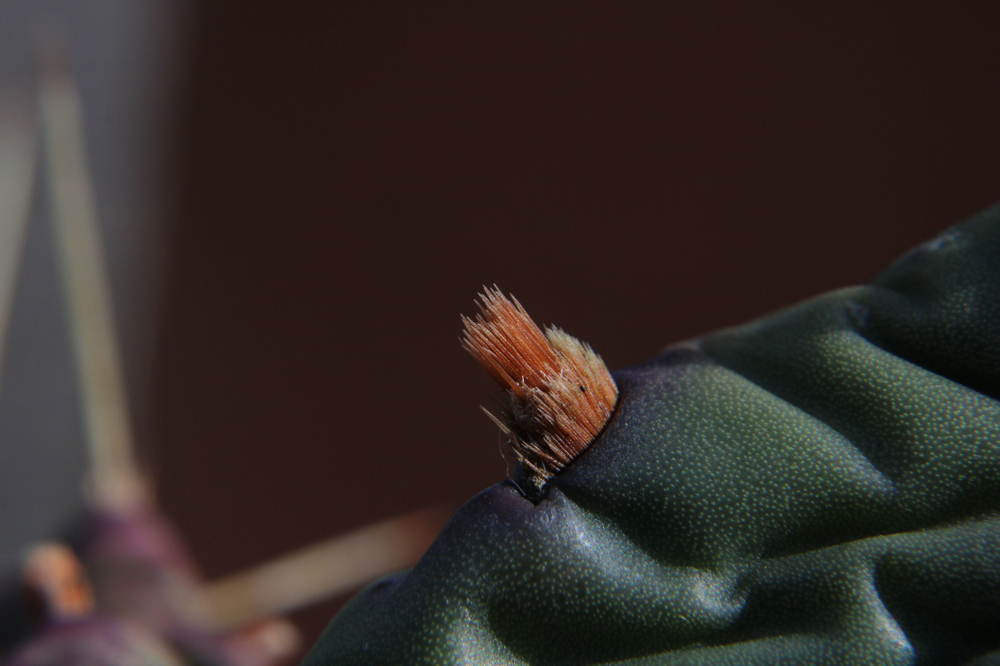
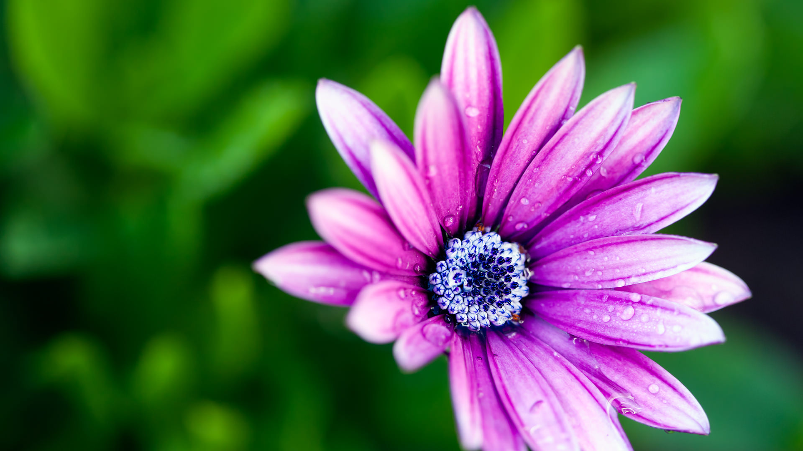
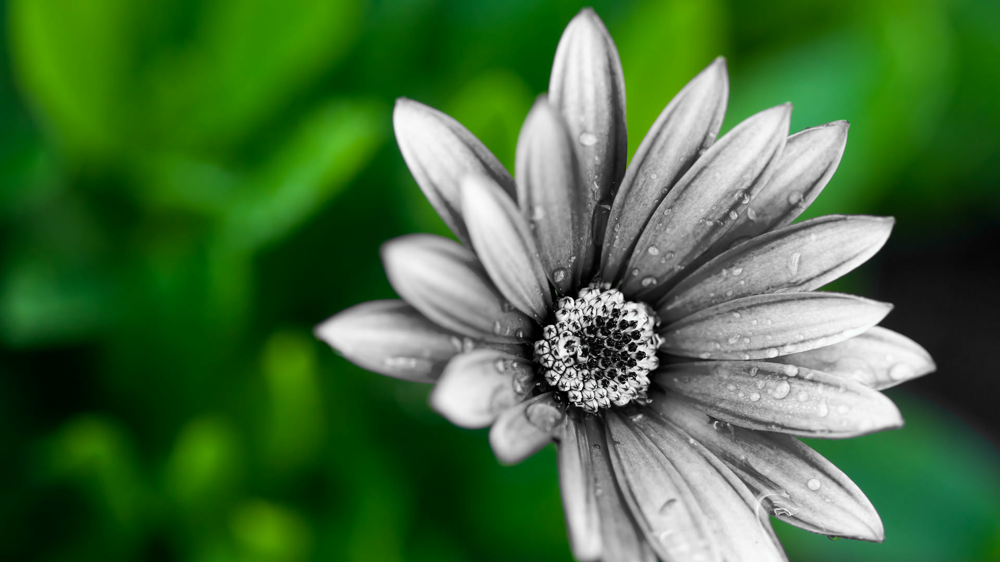
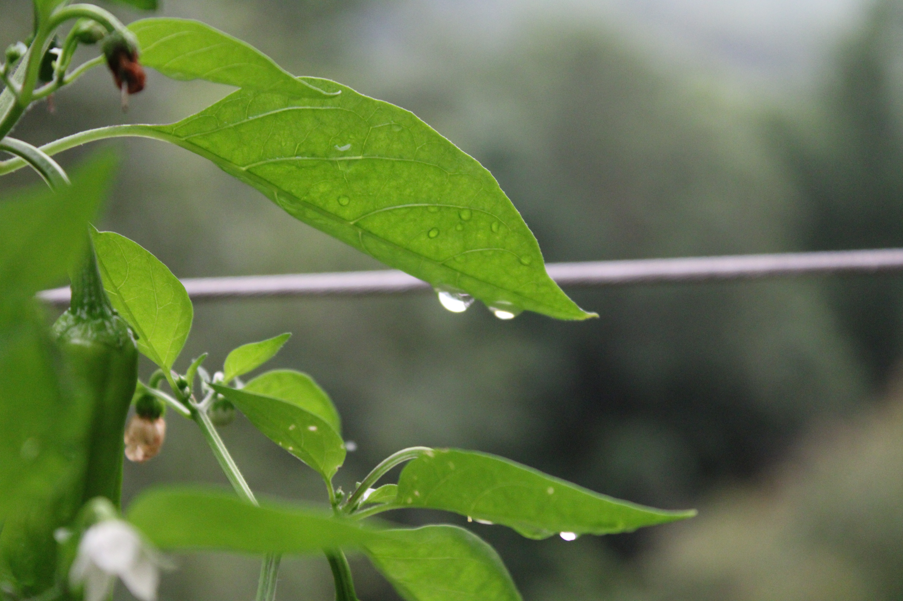
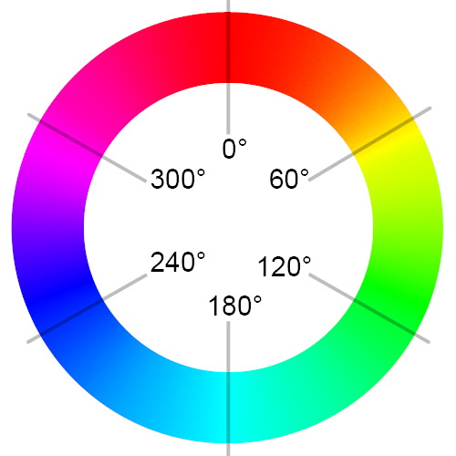
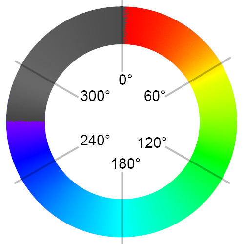

# Rust Image Scripts

A command line tool for quickly making powerful modifications to images. Created to help out with my other hobby, photography!

# Using

To use from scratch, make sure you have rust installed and compile the program from scratch. If you want to use it out of the box, use the "Releases" tab and get the latest version.

It has to be run through the command line, so most likely command prompt on Windows.

Run the program without any args to get a help menu.

The output of the program will always be 'res.png', I'll potentially make this more verbose in the future or allow a custom output file. For now 'res.png' is all I personally need, so that's what it has.

# Current Features

I'll add features when I need them.

1. Remove Color Channel (r, g, b, or a)
2. Isolate Color Range (hsl from deg-to deg)

# Examples

Original|Modified|Command
----|----|---
||ris a.jpg 0 2
||ris b.jpg 1 70 180
||ris d.jpg 1 0 40
||ris c.png 1 0 270
